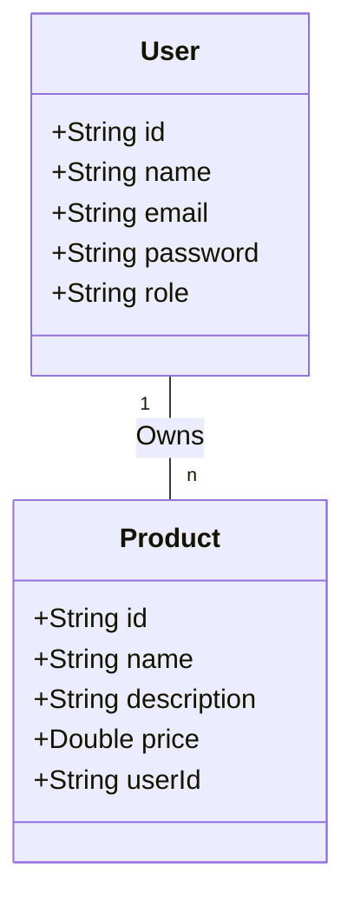

## Let's Play

### Overview

In this project, you will build a **RESTful CRUD API** called **Let's Play**, using **Spring Boot** with **MongoDB**.  
The system will manage users and products, allowing operations such as creating, reading, updating, and deleting both entities.  
You will also implement **authentication and authorization** using token-based security, ensuring that only authorized users can perform restricted actions.

This project focuses on backend development best practices — secure coding, error handling, REST design principles, and role-based access management.

### Role Play

You are a **backend developer** in charge of designing a secure and scalable REST API for a small e-commerce-like platform.  
Your goal is to create an application that allows admins to manage all users and products while normal users can manage their own products.  
The system must be secure, robust, and fully compliant with REST standards.

### Learning Objectives

- Master **Spring Boot** and RESTful API design
- Integrate and manage data using **MongoDB**
- Implement **CRUD operations** for multiple entities
- Apply **Spring Security** and **JWT** authentication
- Handle **role-based access control** (admin vs. user)
- Implement **secure password handling** (hashing and salting)
- Build **robust error handling** with meaningful HTTP responses

### Instructions

#### 1. Database Design

Design two main entities: **User** and **Product**, with a one-to-many relationship — each user can own multiple products.

#### 2. API Development

- Build RESTful APIs for both **Users** and **Products** following proper HTTP methods and response codes.
- Implement CRUD endpoints for each entity:
    - `GET /products` → public access (no authentication required)
    - `POST /products` → create a new product (authenticated users only)
    - `PUT /products/{id}` and `DELETE /products/{id}` → restricted to product owners or admins
    - `GET /users` and related endpoints → accessible to admins only

- Follow REST conventions for resource naming and structure.

#### 3. Authentication & Authorization

- Implement **JWT-based authentication** using **Spring Security**.
- Allow users to register, log in, and receive tokens for authentication.
- Restrict access based on roles:
    - **Admin**: manage all users and products
    - **User**: manage only their own products

> 💡 Use Spring Security to manage tokens and role-based permissions.

#### 4. Error Handling

- Ensure the API never returns unhandled `5XX` errors.
- Use global exception handling to capture and format error responses.
- Return clear and appropriate HTTP status codes (`400`, `401`, `403`, `404`, `409`, etc.)
- Provide user-friendly and descriptive error messages.

#### 5. Security Measures

Implement strong security practices throughout your application:

- Hash and salt passwords using **BCrypt** before saving to the database.
- Validate and sanitize user inputs to prevent **MongoDB injection attacks**.
- Exclude sensitive fields (e.g., password) from API responses.
- Use **HTTPS** for secure data transmission.
- Apply strict access control on all endpoints.

### Constraints

- Use **Spring Boot** and **MongoDB** (no SQL databases)
- Use **Spring Security** or **JWT** for authentication
- Return all data in **JSON** format
- No sensitive data should ever appear in API responses

### Evaluation

This project will be evaluated through a **code review** and **functional testing**.  
Evaluation criteria include:

- ⚙️ **Functionality**: All CRUD and authentication features implemented correctly
- 🔐 **Security**: Proper authentication, authorization, and password handling
- 🚫 **Error Handling**: No unhandled 5XX errors; proper status codes
- 🧱 **Code Quality**: Clean, modular, and well-structured code
- 📘 **Documentation**: Clear instructions and endpoint explanations

### Bonus Features (Optional but Recommended)

- 🧭 **CORS Configuration**: Implement fine-grained Cross-Origin Resource Sharing policies
- 🚦 **Rate Limiting**: Prevent brute-force or excessive API requests

### Resources

- [Spring Initializer](https://start.spring.io/)
- [Spring Boot Documentation](https://spring.io/projects/spring-boot)
- [Spring Security Guide](https://spring.io/guides/gs/securing-web/)
- [JWT Introduction – Auth0](https://auth0.com/learn/json-web-tokens/)
- [MongoDB Official Documentation](https://www.mongodb.com/docs/)
- [REST API Design Guidelines – GitHub Docs](https://docs.github.com/en/rest?apiVersion=2022-11-28)
- [Baeldung: Error Handling in Spring Boot](https://www.baeldung.com/exception-handling-for-rest-with-spring)